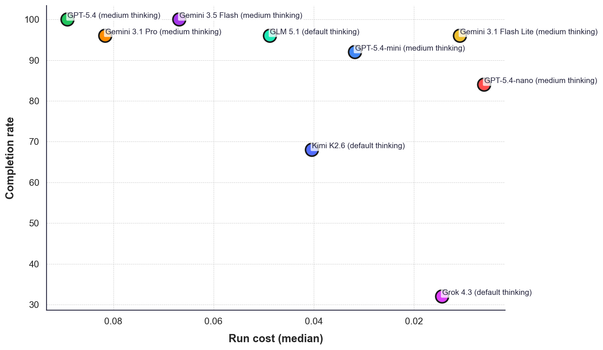

# Leaderboard — run_20260520_10h46_0a4cea

|   Rank | Agent                                   |   Completion rate |   Run cost (median) |
|-------:|:----------------------------------------|------------------:|--------------------:|
|      1 | Gemini 3.5 Flash (medium thinking)      |               100 |               0.067 |
|      2 | GPT-5.4 (medium thinking)               |               100 |               0.089 |
|      3 | Gemini 3.1 Flash Lite (medium thinking) |                96 |               0.011 |
|      4 | GLM 5.1 (default thinking)              |                96 |               0.049 |
|      5 | Gemini 3.1 Pro (medium thinking)        |                96 |               0.082 |
|      6 | GPT-5.4-mini (medium thinking)          |                92 |               0.032 |
|      7 | GPT-5.4-nano (medium thinking)          |                84 |               0.006 |
|      8 | Kimi K2.6 (default thinking)            |                68 |               0.04  |
|      9 | Grok 4.3 (default thinking)             |                32 |               0.014 |

